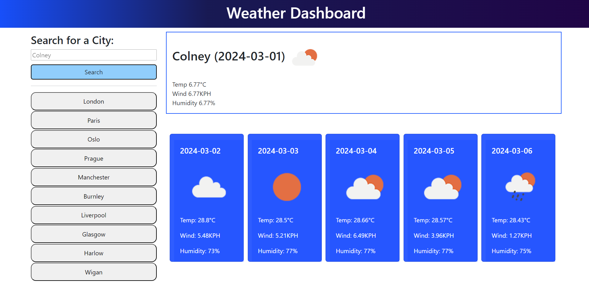

# Weather Sage

## Description

The Weather Sage weather dashboard was developed for travellers to enable them to plan trips by viewing weather outlooks for multiple cities. By integrating the OpenWeatherMap API, users could access current and future weather conditions. The dashboard featured form inputs for city searches and displayed detailed information, including city name, date, weather icons, temperature, humidity, and wind speed. Additionally, a 5-day forecast for each city is available and accessible by clicking on the city in the search history.

## Features

-   Current weather information display
-   5-day weather forecast display
-   Search for weather data by city
-   Responsive design for various devices

## Table of Contents

-   [Weather Sage](#weather-sage)
-   [Description](#decription)
-   [Features](#features)
-   [Installation](#installation)
-   [Usage](#usage)
-   [Demo](#demo)
-   [Screenshots](#screenshots)
-   [Animated Gifs](#animated-gifs)
-   [Credits](#credits)
-   [List of Third Party Assets](#list-of-third-party-assets)
-   [Roadmap](#roadmap)
-   [Contributing](#contributing)
-   [License](#license)

## Installation

N/A

## Usage

1. Enter the city name in the search bar.
2. Click the "Search" button.
3. View the current weather details and the 5-day forecast for the specified city.

## Demo

You can interact with the Weather Sage App [here](https://francis-gomes-esq.github.io/weather-sage/)

### Screenshots

-   

<<<<<<< HEAD
=======

>>>>>>> 9b59de8c8d40f32289b1996ae1d395bb398a3cc2
-   

### Animated Gifs

-   

## Credits

-   Tutor sessions
-   Class lectures and recordings

## List of third-party assets.

-   [OpenWeather API](https://api.openweathermap.org/forecast5)
-   [DayJs](https://day.js.org/)
-   [jQuery](https://releases.jquery.com/)
-   [Bootstrap](https://getbootstrap.com/)
-   [Mock Up](./assets/images/mock-up/10-server-side-apis-challenge-demo.png)

## Roadmap

More work is required to get the application to where it needs to be. For example: CSS for styling, code refactoring, and testing.

## Contributing

Contributions and improvement suggestions are welcome! Follow these steps to contribute:

1. Fork the project.
2. Create a new branch (`git checkout -b feature/your-feature`).
3. Commit your changes (`git commit -a -m 'Add some feature'`).
4. Push to the branch (`git push origin feature/your-feature`).
5. Open a pull request.

## License

Weather Sage is licenced under the [MIT License](https://github.com/francis-gomes-esq/weather-sage/tree/main?tab=MIT-1-ov-file). For details, refer to the repo.

---

© 2024 Francis Gomes-Okoye.
